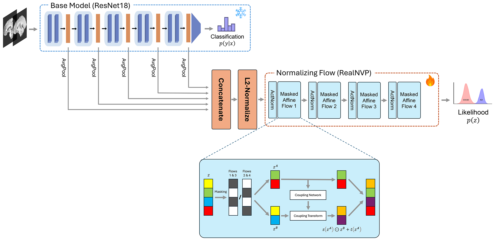

# MedOODFlow: Enhancing Out-of-Distribution Detection in Medical Imaging with Normalizing Flows

This repository contains the code for the paper "Enhancing Out-of-Distribution Detection in Medical Imaging with Normalizing Flows"
by XXXXX.


## Abstract
Out-of-distribution (OOD) detection is a critical challenge in medical imaging, where unexpected data can lead to significant diagnostic errors. This study presents a novel normalizing flow-based method for OOD detection, designed to enhance the reliability of medical imaging systems. Our approach operates post-hoc, ensuring that it can be integrated without altering the weights of pre-trained models. We first evaluate our method using the MedMNIST benchmark dataset, demonstrating its effectiveness. Additionally, we introduce a new OOD benchmark dataset, curated from various public medical image sources, to further validate our approach. Our results indicate that the proposed model accurately detects diverse types of shifts, including population shifts, age shifts, and modality shifts, with high precision. This advancement underscores the potential of normalizing flows in improving the robustness of medical imaging applications.



## Based on OpenOOD
This project is built upon [OpenOOD](https://github.com/Jingkang50/OpenOOD). For more details, you can refer to the original README file [here](OpenOOD_README.md).


## Installation
Create a Python 3.10+ environment and install the required packages:
```sh
pip install -r requirements.txt
pip install libmr
```

## Getting Started

### Download MedMNIST Datasets
To download the required 28x28 image-sized datasets from the MedMNIST benchmark, first install the `medmnist` package:
```sh
pip install medmnist
```
Then, run the following script:
```sh
sh ./scripts/download/download_medmnist.sh
```

### Download and Prepare MedOOD Datasets
We created a curated collection of medical datasets, **MedOOD**, specifically designed to benchmark OOD detection in
medical imaging. It includes datasets from diverse imaging modalities and clinically relevant distributional shifts,
providing a robust foundation for evaluating OOD detection models.
For instructions on preparing the MedOOD datasets, please refer to the [medood/README.md](medood/README.md) file.


### Training and evaluation scripts
We provide the training, evaluation, and visualization scripts for our proposed OOD detection method in [scripts/ood/nflow](scripts/ood/nflow) folder.

### Pre-trained ResNet18 classifier on OrganAMNIST
For the ResNet18 classifier on OrganAMNIST, we utilized the official pre-trained model provided by the MedMNIST curators.
You can download the pre-trained model from [here](https://doi.org/10.5281/zenodo.7782113).
In our experiments, we specifically used the `resnet18_28_1.pth` file included in the `weights_organamnist.zip` archive.

### Train a 3D-ResNet18 classifier on BraTS2020-T1:
To train a 3D-ResNet18 classifier on BraTS2020-T1, you can run the following script:
```sh
sh ./scripts/basics/brats20_t1/train_brats20_t1.sh
```

## Citation

If you find this work useful for your research, please cite our paper.

```bibtex
@article{XXXXX,
  title={Enhancing Out-of-Distribution Detection in Medical Imaging with Normalizing Flows},
  author={XXXXX},
  journal={arXiv preprint arXiv:XXXXX},
  year={2025}
}
```
